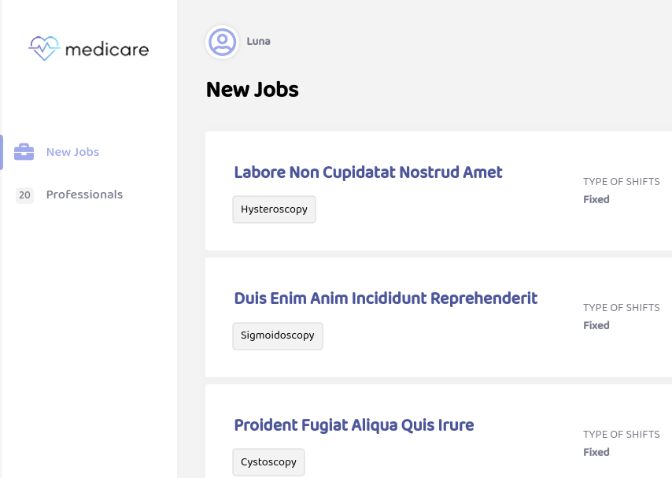

# Medicare

A fictional freelancing platform for healthcare workers. It's my first project using the MERN stack.
[Live view](https://medicare-app.herokuapp.com/)

## Features

- Simple CRUD for jobs
- Simple CRUD for doctors and nurses
- JWT authentication

## How to run locally

- First, add the MongoDB connection string to the `.env.example` file and rename it to `.env`.
- Clone the repo and go to folder:
  git clone https://github.com/henrispkl/medicare.git
  cd medicare

- Install all dependencies and run the project
  npm install
  npm run dev

- Build the project and run using the build files:
  npm run build
  npm start

## Technologies used

Front-end:

- React
- React Router
- Redux
- Axios

Back-end:

- Node
- Mongoose
- MongoDB Atlas
